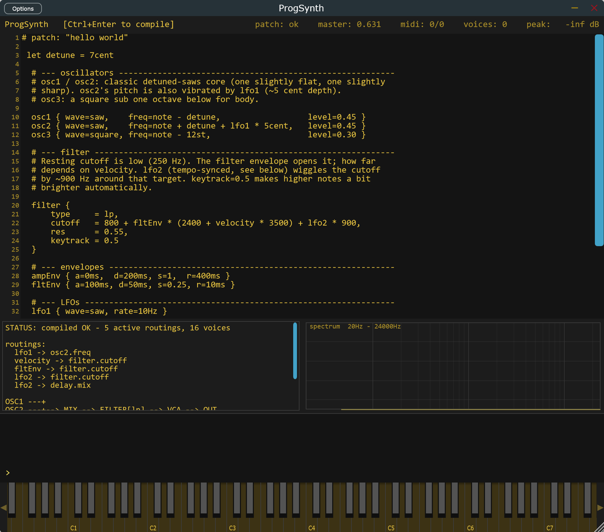

```
──────────  ::ασε~  ──
alien sound engineering
───── P R O G S Y N T H
```
Programmable subtractive synthesizer.



---


## Features
- Three oscillators (sine / triangle / saw / square), low-/high-pass filter with envelope and key-tracking, two ADSR envelopes, two LFOs (free or tempo-synced).
- Optional FX chain in fixed order: **distortion → eq → compressor → chorus → flanger → delay → reverb**.
- Patches are written in a small typed DSL with units (`Hz`, `kHz`, `ms`, `s`, `st`, `cent`, `dB`, `%`) and tempo-synced rate literals (`1/4`, `1/8t`, `1/16.`).
- Built-in modulation sources (`pitch`, `velocity`, `gate`, `ampEnv`, `fltEnv`, `lfo1`, `lfo2`) usable in any expression, with reusable `let` bindings.
- Compiles to a tiny stack-machine bytecode; the audio thread never allocates and never throws.
- Embedded code editor, REPL, status pane and spectrum view inside the plugin.
- Ships as **VST3** and **Standalone**.

## The patch language
Patches are the whole point. See **[LANGUAGE.md](LANGUAGE.md)** for the full reference (lexical structure, every block, every parameter, unit coercion rules, expression VM, defaults and diagnostics).

A minimal taste:

```
let wobble = lfo1 * 200Hz

osc1 { wave = saw, freq = pitch,        level = 0.6 }
osc2 { wave = saw, freq = pitch + 7cent, level = 0.5 }

filter { type = lp, cutoff = 600Hz + 1500Hz * fltEnv + wobble, res = 0.3, env = 0.8 }

ampEnv { a = 5ms,  d = 200ms, s = 0.7, r = 300ms }
fltEnv { a = 50ms, d = 800ms, s = 0.4, r = 600ms }
lfo1   { wave = sine, rate = 4Hz }

delay  { time = 1/8, sync = on, feedback = 0.45, mix = 0.25 }
reverb { mix = 0.25, size = 0.7 }
master { volume = -3dB }
```

An empty source is also a valid program, it produces a default sawtooth synth at -6 dB.

## Downloads
Pre-built binaries (VST3 + Standalone) for Windows (x64, ARM64), macOS (universal) and Linux (x64) are published on the [Releases page](https://github.com/aliensoundengineering/ProgSynth/releases/latest).


## Building from source

Requirements: CMake ≥ 3.22, a C++17 compiler, and the JUCE submodule.

```bash
git clone --recurse-submodules https://github.com/aliensoundengineering/ProgSynth.git
cd ProgSynth
cmake -B build -DCMAKE_BUILD_TYPE=Release
cmake --build build --config Release --parallel
```

Artefacts land in `build/ProgSynth_artefacts/Release/` under `VST3/` and `Standalone/`.

On Linux you'll also need the usual JUCE dependencies — see the [Release workflow](.github/workflows/release.yml) for the exact `apt-get` list.

## Project layout

```
Source/
├── lang/   # lexer, parser, AST, compiler, expression VM
├── dsp/    # oscillators, filter, envelopes, LFOs, voice, engine
└── ui/     # editor, REPL, status pane, spectrum view
```
